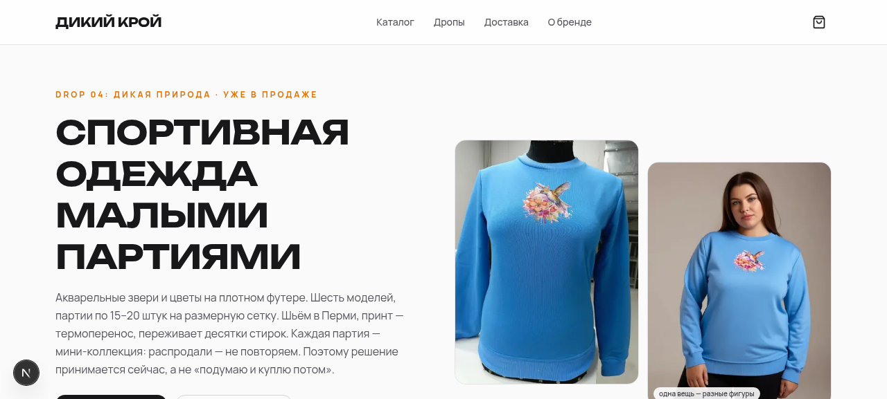
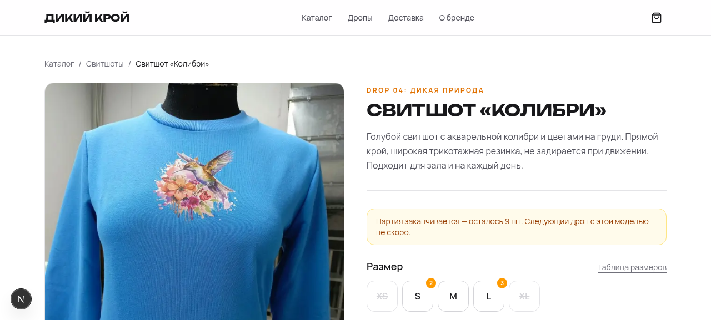

# Дикий крой — магазин спортивной одежды малыми партиями

E-commerce на Next.js 16 (App Router) для бренда, который шь спортивную одежду ограниченными дропами: партии по 15–20 штук на размерную сетку, распродано — не повторяем.

[](https://nextjs.org) [](https://www.typescriptlang.org) [](https://www.prisma.io) [](https://tailwindcss.com)



## Что внутри

- **Дроп-модель** — товары привязаны к дропам: текущий показывается на главной, прошлые уходят в архив (`/drops`). Дата релиза и состав партии — в одном файле данных.
- **Корзина с размерными вариантами** — уникальная позиция = `productId + size`: два размера одной модели — это две строки. React Context + localStorage (через `useSyncExternalStore`, SSR-безопасно), количество ограничено остатком размера.
- **UX дефицита** — баннер «партия заканчивается» при остатке ≤ 10 шт, янтарные бейджи на размерах с остатком ≤ 3, распроданные размеры зачёркнуты (не скрыты — это сигнал, что бренд покупают), полностью распроданный товар собирает email на анонс следующего дропа.
- **Чекаут без онлайн-платежа (MVP)** — приём заказа с тремя способами доставки (самовывоз / курьер по Перми / СДЭК «рассчитает менеджер»), предоплата переводом по СБП. Цены и остатки пересчитываются на сервере — клиенту доверяем только выбор товара, размера и количества.
- **Заказы и подписки → Telegram** — новый заказ и подписка на анонс прилетают владельцу ботом. На serverless-хостинге (Vercel) файловая SQLite недоступна, поэтому Telegram — основной канал приёма: заказ не теряется даже без БД.
- **AI-фото посадки** — для каждого товара фото на двух типах фигур (44–46 и 50–52) с честной пометкой «сгенерировано ИИ»; в карточке — таблица размеров в сантиметрах.
- **SEO/SSG** — статическая генерация товарных страниц (`generateStaticParams` + metadata), страница доставки и возврата (14 дней по закону для готовых изделий).



## Стек

Next.js 16 · TypeScript · Tailwind CSS 4 · shadcn/ui · Prisma (SQLite) · React Context · Zod · Telegram Bot API

## Быстрый старт

```bash
npm install            # или bun install
npx prisma db push     # создать SQLite-базу
cp .env.example .env   # заполнить переменные
npm run dev
```

### Переменные окружения

| Переменная | Обязательна | Назначение |
|---|---|---|
| `DATABASE_URL` | локально | SQLite, например `file:/abs/path/db/custom.db` |
| `TELEGRAM_BOT_TOKEN` | для заказов | токен бота, который присылает заказы владельцу |
| `TELEGRAM_CHAT_ID` | для заказов | chat_id получателя (узнать: написать боту и вызвать `getUpdates`) |

## Деплой

Проект задеплоен на Vercel. Нюанс serverless: SQLite в рантайме недоступна, поэтому API написаны устойчиво — заказ/подписка сначала пробуют сохраниться в БД, при неудаче гарантированно уходят в Telegram (это основной канал). Локально и на VPS SQLite работает полноценно: журнал заказов копится в базе, Telegram остаётся дублем-уведомлением.

## Управление ассортиментом

Остатки, цены, размерные сетки и состав дропов правятся в одном файле — `src/lib/data.ts`. Изменение стока не требует миграций: количество конкретного размера — это поле `stock` в описании товара.

## Структура

```
src/
  app/                    # страницы: /, /drops, /catalog, /product, /cart, /checkout, /delivery
    api/order/            # приём заказа: валидация → пересчёт цен → БД + Telegram
    api/subscribe/        # подписка на анонс дропа
  components/             # Header, ProductCard, AddToCart (UX дефицита), ProductGallery, ...
  lib/
    data.ts               # ← ассортимент: товары, дропы, остатки, размерные сетки
    cart-context.tsx      # корзина (productId+size, localStorage)
    order-data.ts         # варианты доставки, серверный пересчёт
prisma/schema.prisma      # Order, Subscriber
```
